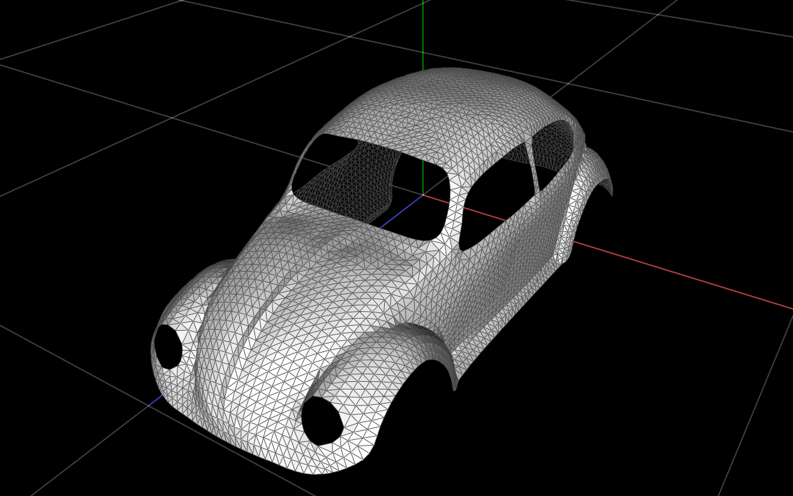
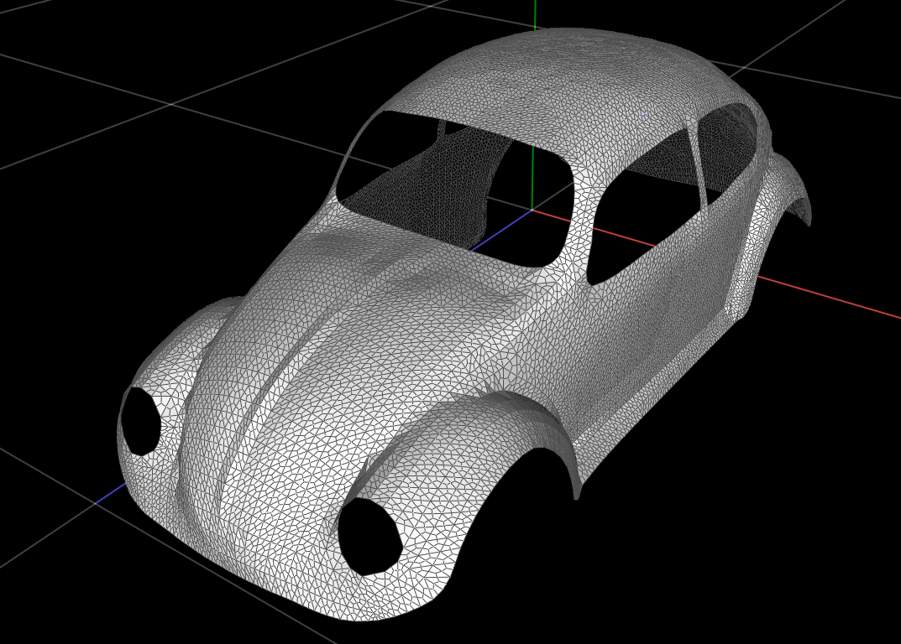

# CMU 15-462 - Scotty3D

Welcome to Scotty3D! This 3D graphics software implements interactive mesh
editing, realistic path tracing, and dynamic animation. Implementing the
functionality of the program constitutes the majority of the coursework for
15-462/662 Computer Graphics at Carnegie Mellon University.

Further information is available in the User Guide and Developer Manual, both
available on the project wiki accessible via tab at the top of the Github.com UI.

[Link to the wiki:](https://github.com/cmu462/Scotty3D/wiki)

[developers guide](https://github.com/cmu462/Scotty3D/wiki/Developer-Manual)

[users guide](https://github.com/cmu462/Scotty3D/wiki/User-Guide)

[build instructions](https://github.com/cmu462/Scotty3D/wiki/Build-Instructions)

# Some implementation details I've had time for so far

1. Here is the initial Beetle mesh:

2. Here it is after 1 round of linear subdivision:

