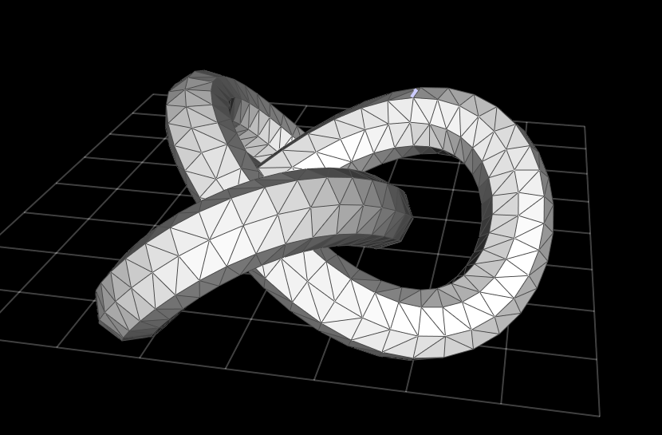
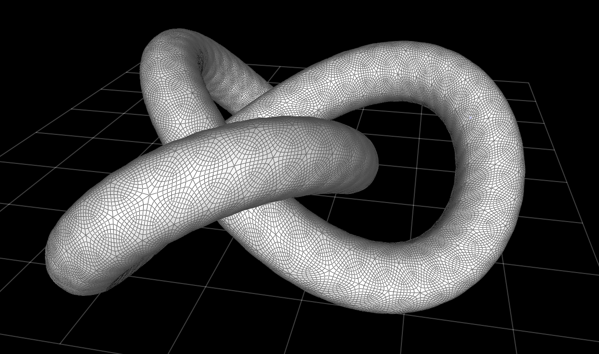
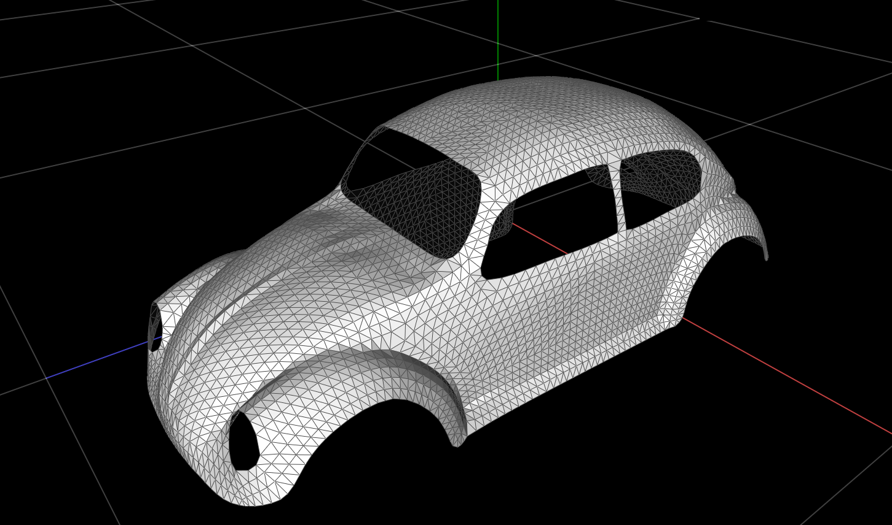
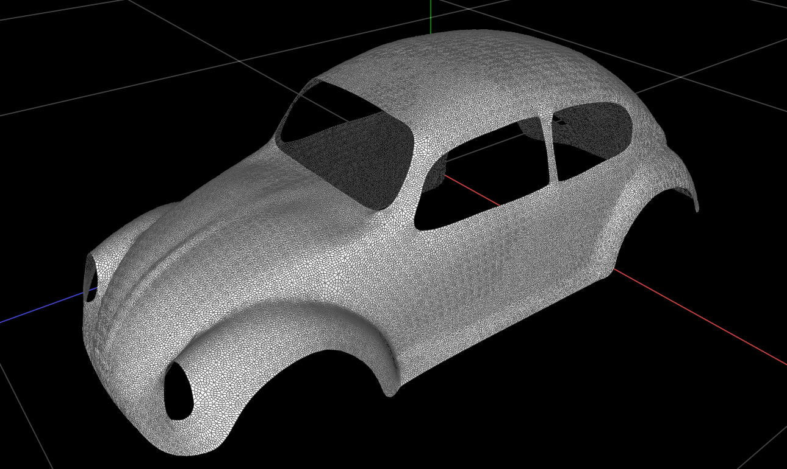
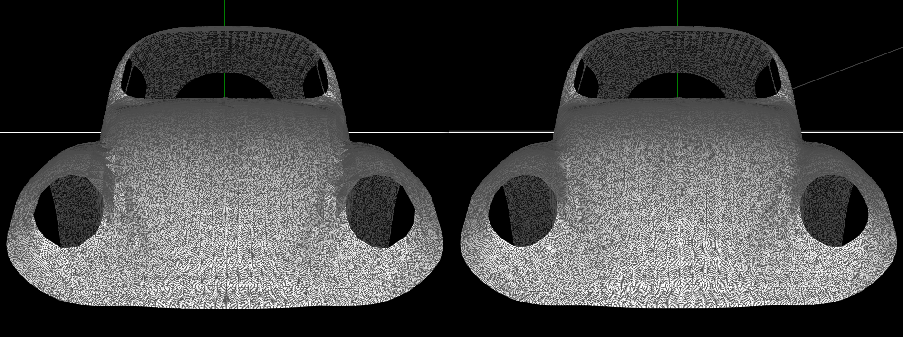

# CMU 15-462 - Scotty3D

Welcome to Scotty3D! This 3D graphics software implements interactive mesh
editing, realistic path tracing, and dynamic animation. Implementing the
functionality of the program constitutes the majority of the coursework for
15-462/662 Computer Graphics at Carnegie Mellon University.

Further information is available in the User Guide and Developer Manual, both
available on the project wiki accessible via tab at the top of the Github.com UI.

[Link to the wiki:](https://github.com/cmu462/Scotty3D/wiki)

[developers guide](https://github.com/cmu462/Scotty3D/wiki/Developer-Manual)

[users guide](https://github.com/cmu462/Scotty3D/wiki/User-Guide)

[build instructions](https://github.com/cmu462/Scotty3D/wiki/Build-Instructions)

# Some implementation details I've had time for so far

1. Linear subdivision
2. Catmul Clark subdivision
3. Catmul Clark with boundaries (creases work the same way)

See further below for a comparison of linear and Catmull-Clark refinement of a mesh with boundary.

## Linear Subdivision:

1. Here is the initial Beetle mesh:

2. Here it is after 1 round of linear subdivision:

## Catmul Clark, naive scheme

1. Here is the initial CrazyTorus mesh:

2. Here is the Catmull refined CrazyTorus:

Of course we have barely scratched the surface with subdivision.  
One thing we need to do is extend the basic method to handle boundaries.
Note that this will also handle creases.

## Catmul Clark, first extension:  Boundary rules

1. Here is the initial Beetle again:

2. Here is the Catmull refined Beetle (2 levels of Catmull-Clark refinement:

## Linear(left) vs Catmull Clark (right), side by side

In the picture above, the beetle model has been subdivided 3 times.
On the left the subdivision method is linear.  On the right, I used Catmull-Clark with boundary rules.
As expected, the Catmull-Clark method gives a higher quality mesh.

### Subdivision things to do:

0. Allow boundaries (done)

1. Boundary conditions 

2. Matrix subdivision operators

3. Stamm's eigenvalue based fast evaluation

4. Other fast evaluators (B-spline patch perhaps...)

### Other things to do:

1. Add discrete differential geometric operators

2. Add automatic differentiation in some way yet to be determined.

3. ?think real hard?

4. variational constrained multiresolution subdivision discrete differential geometry for geometric design?

